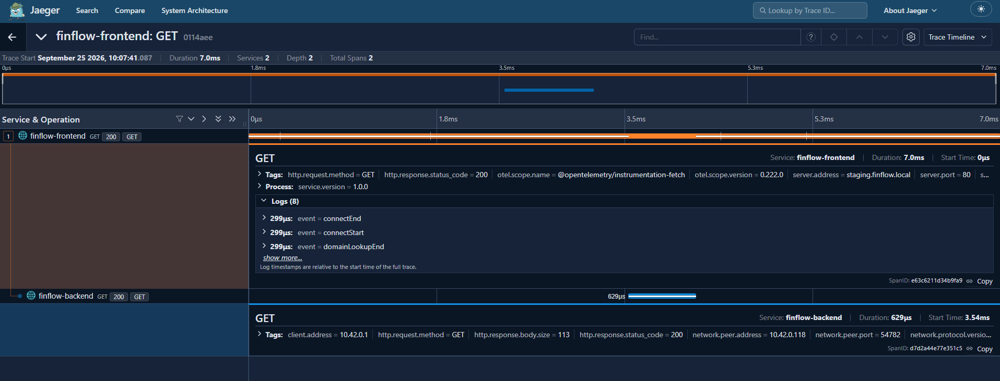
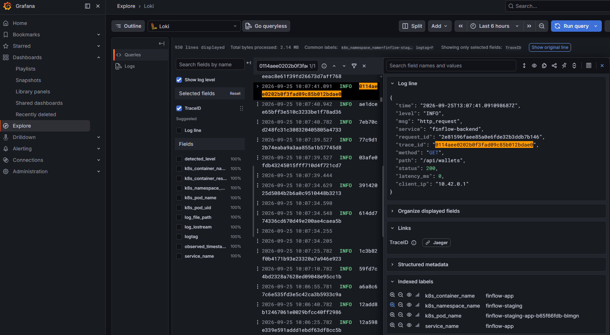

# Informe Técnico — TP Observabilidad y Confiabilidad

> **Documento unificado de entrega y guion de presentación.**
> Cada sección indica su responsable. Las secciones marcadas como `PENDIENTE` deben completarse con capturas y detalles de la implementación.

---

## Equipo

| Integrante | Rol en el TP |
|---|---|
| Josias | Infraestructura (Harbor, ArgoCD, Argo Rollouts), OTel, Jaeger, Loki |
| Maxi | Logs estructurados y correlación del frontend |
| Jero | Trazas distribuidas (OpenTelemetry) |
| Lautaro | Saturación (cAdvisor) y laboratorio de simulación |
| Gabriel | Grafana como código, dashboard Golden Signals, documentación y postmortem |

---

## 0. Resumen Ejecutivo

FinFlow es una fintech de billeteras y pagos desplegada en un clúster local Kubernetes (K3D) gestionado por GitOps (ArgoCD). Sobre ese sistema implementamos las tres pilares de la observabilidad —**métricas, logs y trazas**— con Prometheus/Grafana, Loki y Jaeger, más un dashboard con las 4 Golden Signals de Google SRE. Como ejercicio adicional, diseñamos un **laboratorio de inyección de fallos** (`/lab`) y documentamos un **postmortem blameless (RCA)** de un incidente simulado.

---

## 1. El Sistema: FinFlow

- **Qué es:** fintech con billeteras (`/api/wallets`) y transferencias (`/api/payments`).
- **Servicios:** frontend (React) + backend (Go/Gin) + PostgreSQL + Redis + Unleash (feature flags).
- **Comunicación entre servicios:** el frontend consume la API REST del backend; el backend persiste en Postgres y cachea en Redis.

> **PENDIENTE — Diagrama de arquitectura** (generar con archify o adjuntar captura).

---

## 2. Despliegue y GitOps

> **PENDIENTE — Responsable: Josias**

Puntos a cubrir:
- Clúster local K3D y cómo se levanta (`make up`).
- ArgoCD app-of-apps (`root-local` → aplicaciones por servicio).
- **Argo Rollouts** con estrategia canary (`setWeight: 33` + `pause`) y promoción manual.
- Harbor privado vía Tailscale y el runner local de CI/CD (build multi-arquitectura).
- *Evidencia:* captura de la UI de ArgoCD / Argo Rollouts con el canary pausado.

---

## 3. Métricas y las 4 Golden Signals

> **Responsable: Gabriel** (dashboard) + **Lautaro** (saturación con cAdvisor)

### 3.1 Recolección de métricas
- **Prometheus** scrapea el backend Go (métricas de Gin: `gin_requests_total`, `gin_request_duration_seconds_bucket`).
- **cAdvisor** (kubelet) expone métricas reales de contenedor: `container_cpu_usage_seconds_total`, `container_memory_working_set_bytes`, `container_spec_cpu_quota`, etc.

### 3.2 Grafana como código (IaC)
- Los **DataSources** y **dashboards** se provisionan por ConfigMaps montados en Grafana (no se tocan a mano).
- Los dashboards se versionan en Git y se despliegan con ArgoCD.

### 3.3 Las 4 Golden Signals

| Señal | Métrica | Query PromQL |
|---|---|---|
| **Tráfico** | `gin_requests_total` | `sum(rate(gin_requests_total{namespace=~"$namespace"}[1m])) by (code)` |
| **Latencia** | `gin_request_duration_seconds_bucket` | `histogram_quantile(0.95, sum(rate(...{code=~"[23].."}[5m])) by (le))` |
| **Errores** | `gin_requests_total` | `((sum(rate(...{code=~"5.."}[1m])) or vector(0)) / ...) * 100` |
| **Saturación** | cAdvisor | `rate(container_cpu_usage_seconds_total[2m]) / (container_spec_cpu_quota / container_spec_cpu_period)` |

> **Nota SRE:** la latencia se mide solo sobre peticiones **exitosas** (`code=~"[23].."`) para no falsear el percentil con errores rápidos de validación.

*Evidencia:* captura del dashboard `FinFlow - 4 Golden Signals`.

---

## 4. Logs estructurados y correlación

> **PENDIENTE — Responsable: Maxi** (frontend) + **Josias** (backend/Loki)

Puntos a cubrir:
- Logs JSON estructurados en el backend (`log/slog`) con `request_id` y `latency_ms`.
- Logs JSON en el frontend (misma clave `msg: "http_request"`).
- **Correlación:** el frontend genera el `request_id` → lo envía por header `X-Request-ID` → el backend lo **reusa**.
- Loki centraliza los logs de todos los pods (vía OTel collector agent).
- *Evidencia:* captura de Loki mostrando logs de front y back con el mismo `request_id`.

---

## 5. Trazas distribuidas con OpenTelemetry

Puntos a cubrir:
- SDK OpenTelemetry en el backend Go (`internal/telemetry/tracer.go`).
- Web SDK en el frontend (`WebTracerProvider` + `FetchInstrumentation` con propagación de `traceparent`).
- Collector OTel (gateway) → Jaeger.
- **Traza distribuida de punta a punta** (frontend → backend).
- Correlación métricas/logs/trazas por `trace_id` (Data Links de Loki → Jaeger).
- *Evidencia:* captura de Jaeger con un trace completo.

### 5.1 SDK OpenTelemetry en el backend (Go)
 
`internal/telemetry/tracer.go` expone `InitTracer(ctx, serviceName)`, que se invoca una única vez al arrancar el proceso (`cmd/finflow/main.go`) con `serviceName = "finflow-backend"`:
 
- Exportador **OTLP/HTTP** (`otlptracehttp`) hacia el endpoint definido por la variable de entorno `OTEL_EXPORTER_OTLP_ENDPOINT` (en el clúster apunta al Collector gateway, `otelcol-gateway:4318`; en local cae por defecto a `localhost:4318`), publicando en `/v1/traces` sin TLS (`WithInsecure`, válido dentro del clúster).
- Propagador compuesto **W3C TraceContext + Baggage**, registrado como propagador global (`otel.SetTextMapPropagator`) para que cualquier request entrante/saliente respete el header `traceparent`.
- Si `InitTracer` falla, la app **no aborta**: loguea un warning y sigue sin tracing, y en éxito se registra el `Shutdown` del `TracerProvider` con `defer` (timeout de 5s) para flushear los spans pendientes al cerrar el proceso.
La instrumentación del servidor HTTP es automática y no invasiva: en `internal/api/server.go`, el router de Gin se envuelve con `otelhttp.NewHandler(router, "finflow-backend")`, por lo que **cada request entrante genera un span de servidor** sin tener que instrumentar handler por handler.

### 5.2 Web SDK en el frontend
 
`frontend/src/Telemetry.js` (`initTelemetry()`, invocada al bootstrear la app en `main.jsx`, antes del render) arma el pipeline de tracing en el navegador:
 
- `WebTracerProvider` con `resource` `service.name: "finflow-frontend"`.
- Exportador `OTLPTraceExporter` (HTTP) apuntando a `${VITE_OTEL_COLLECTOR_URL}/v1/traces`, envuelto en un `BatchSpanProcessor` para no disparar un request por cada span.
- `ZoneContextManager` como context manager, necesario para que el contexto de traza sobreviva a callbacks asíncronos (`fetch`, promesas) en el navegador.
- `DocumentLoadInstrumentation`: instrumenta automáticamente la carga de la página (spans de navegación/recursos).
- `FetchInstrumentation`: instrumenta todas las llamadas `fetch()` y es la responsable de la propagación del `traceparent`. La propagación **no se hace a cualquier dominio** (rompería CORS con terceros): `propagateTraceHeaderCorsUrls` se arma con una regex construida a partir del hostname de `VITE_API_URL`, de forma que el header solo se agrega en los requests hacia el backend de FinFlow.

### 5.3 Collector OTel (gateway) → Jaeger
 
Vía ArgoCD (`argocd-infrastructure/apps-local/app-opentelemetry-collector.yaml`) se despliega un `opentelemetry-collector` en **modo `deployment`** (el "gateway"):
 
- **Receiver** `otlp` HTTP en `:4318`, con CORS habilitado explícitamente para los orígenes `http://prod.finflow.local` y `http://staging.finflow.local` — esto es lo que permite que el navegador (frontend) exporte spans directamente al Collector. Ese endpoint además se expone hacia afuera del clúster mediante `finflow-infra/templates/ingress-otel.yaml` (rutas `/v1/traces` y `/v1/logs` sobre el puerto 4318).
- **Pipeline de traces**: `otlp` → `batch` → exporta a dos destinos: `otlp/jaeger` (gRPC, `jaeger.finflow-infra.svc.cluster.local:4317`, insecure dentro del clúster) y `debug` (verbosity `detailed`, para inspección local).
- Existe además un segundo Collector en **modo `daemonset`** (`otelcol-agent`), pero ese solo tiene habilitado el pipeline de **logs** hacia Loki (`presets.logsCollection`) — no participa del pipeline de trazas, que corre íntegramente por el gateway.
- **Jaeger** se instala como Helm chart oficial (`jaegertracing/helm-charts`, `app-jaeger.yaml`) en el namespace `finflow-infra`, y es quien finalmente persiste y sirve la UI de trazas (`:16686`).

### 5.4 Traza distribuida de punta a punta
 
El flujo de una traza completa (ej. el usuario crea una transferencia desde la SPA) es:
 
1. El **frontend** dispara un `fetch()` hacia `/api/payments`. `FetchInstrumentation` crea un span cliente y, como el dominio matchea la regex de `VITE_API_URL`, inyecta el header `traceparent` con el `trace_id`/`span_id` generados en el navegador.
2. Ese `fetch` viaja en paralelo por dos canales: los spans del navegador van directo al Collector gateway (`/v1/traces`), y el request HTTP en sí llega al **backend**.
3. En el backend, `otelhttp.NewHandler` lee el `traceparent` entrante, **continúa la misma traza** (no crea una traza nueva) y abre un span de servidor para el request.
4. El backend exporta ese span vía OTLP/HTTP al mismo Collector gateway, que lo reenvía a Jaeger junto con los spans del frontend.
5. En Jaeger, al buscar por ese `trace_id`, el trace queda compuesto por el span del cliente (`finflow-frontend`) y el span del servidor (`finflow-backend`) como hijo, mostrando el salto completo navegador → backend.

### 5.5 Correlación métricas/logs/trazas por `trace_id`
 
La correlación logs↔trazas se resuelve en dos puntos:
 
- **Backend → log:** en `internal/logging/logging.go`, `WithRequestID` arma el logger de cada request y, si hay un span activo en el `context.Context` (el que abre `otelhttp` en `server.go`), agrega el campo `trace_id` (además del `request_id` propio de la Parte 4) a **todos** los logs JSON de ese request.
- **Grafana → Data Links** (`finflow-infra/templates/grafana-provisioning.yaml`): el datasource **Loki** define un `derivedField` que matchea `"trace_id":"([a-f0-9]+)"` en la línea de log y arma un link hacia el datasource **Jaeger** (`Loki → Jaeger`). En simétrico, el datasource **Jaeger** define `tracesToLogsV2` apuntando a Loki con una query armada (`{k8s_container_name="finflow-app"} | json | trace_id="$${__trace.traceId}"`), habilitando también el salto inverso (`Jaeger → Loki`).
Esto permite, desde un log puntual en Loki, saltar con un clic al trace completo en Jaeger, y desde un trace en Jaeger, ver los logs asociados a ese mismo `trace_id`.
 
### 5.6 Envidencia de las trazas 


*Figura 1: Cascada distribuida completa generada a partir de la petición originada en `finflow-frontend` hacia `finflow-backend` (`GET /api/wallets`, HTTP 200), correlacionada con el mismo `trace_id` obtenido en el log.*


*Figura 2: Registro estructurado en Grafana Loki para el servicio `finflow-backend` con el atributo `trace_id` (`0114aee0202b0f3fad09c85b012bdae0`) y el campo derivado configurado (`TraceID -> Jaeger`) para navegación contextual directa hacia la traza.*

---

## 6. Incidente simulado y postmortem (RCA)

> **Responsable: Gabriel** (documentación) + **Lautaro** (laboratorio `/lab`)

### 6.1 Laboratorio de inyección de fallos
- SPA en `/lab` con una página por señal (`/lab/traffic`, `/lab/latency`, `/lab/errors`, `/lab/saturation`).
- Endpoints de inyección controlada (con topes de seguridad): `/api/lab/cpu`, `/api/lab/slow`, `/api/lab/error`, `/api/lab/burst`, `/api/lab/memory`.

### 6.2 Simulacro de incidente
- Escenario A: inyección por el laboratorio (reproducible).
- Escenario B: caída de una dependencia real (PostgreSQL) para el RCA sistémico.
- Procedimiento completo en `docs/instructivo-simulacro-incidente.md`.

### 6.3 Postmortem blameless
- Estructura: resumen, impacto, timeline, **5 Whys**, Error Budget, action items.
- Documento completo en `docs/postmortem-incidente-simulado.md`.

*Evidencia:* capturas del dashboard durante el incidente (pico de errores/latencia/saturación) + fragmento de log con `request_id`.

---

## 7. Demo en vivo (guion de defensa)

> **PENDIENTE — Todos**

Flujo sugerido (≈15 min):

```text
1. Contexto (2 min) — qué es FinFlow y cómo está desplegado.
2. Despliegue GitOps (2 min) — ArgoCD + canary.
3. Métricas → Golden Signals (3 min) — dashboard.
4. Logs → correlación request_id (2 min) — Loki.
5. Trazas → traza distribuida (2 min) — Jaeger.
6. Incidente → postmortem (3 min) — lab + RCA.
7. Cierre (1 min) — lecciones aprendidas.
```

---

## Checklist de entrega

- [ ] Diagrama de arquitectura (Parte 1)
- [ ] Sección de despliegue (Parte 2 — Josias)
- [ ] Sección de logs (Parte 4 — Maxi)
- [ ] Sección de trazas (Parte 5 — Jero)
- [ ] Guion de demo (Parte 7 — Todos)
- [ ] Revisión final y unificación de docs en carpeta `docs/`
