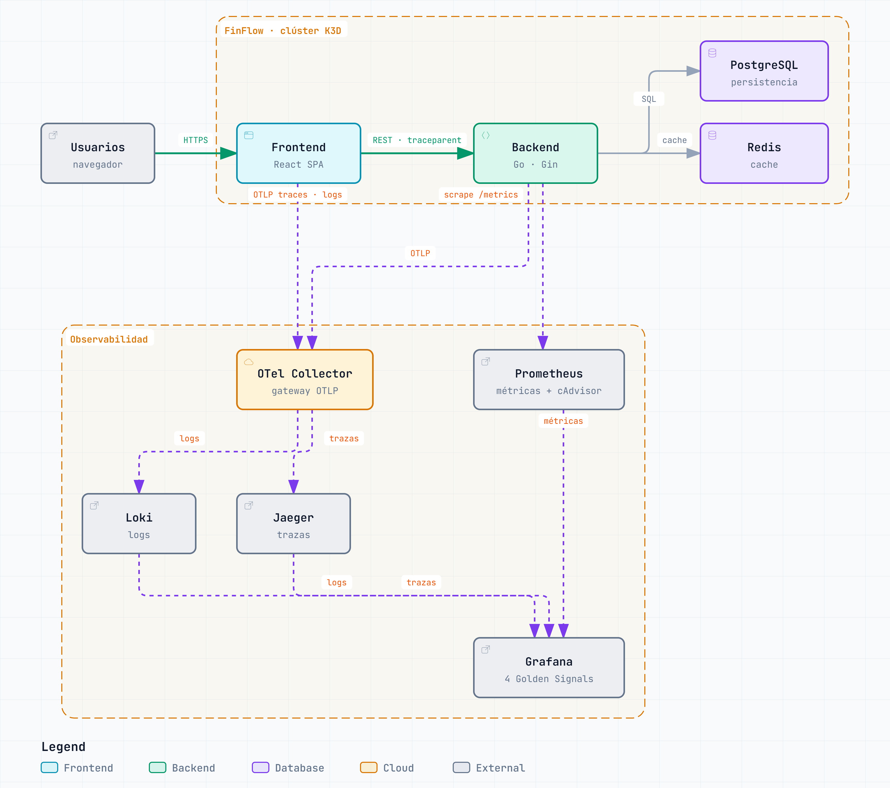
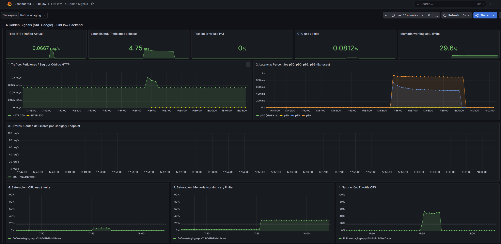
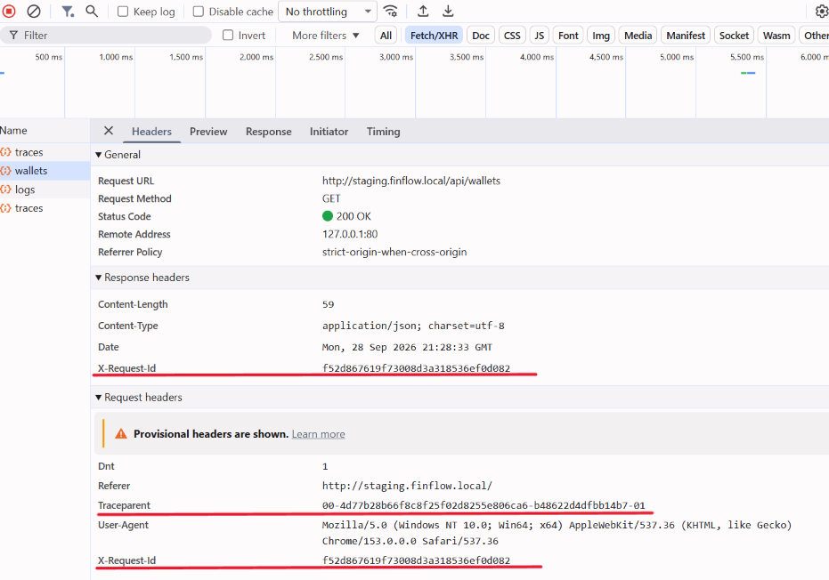
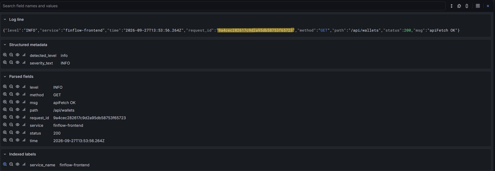
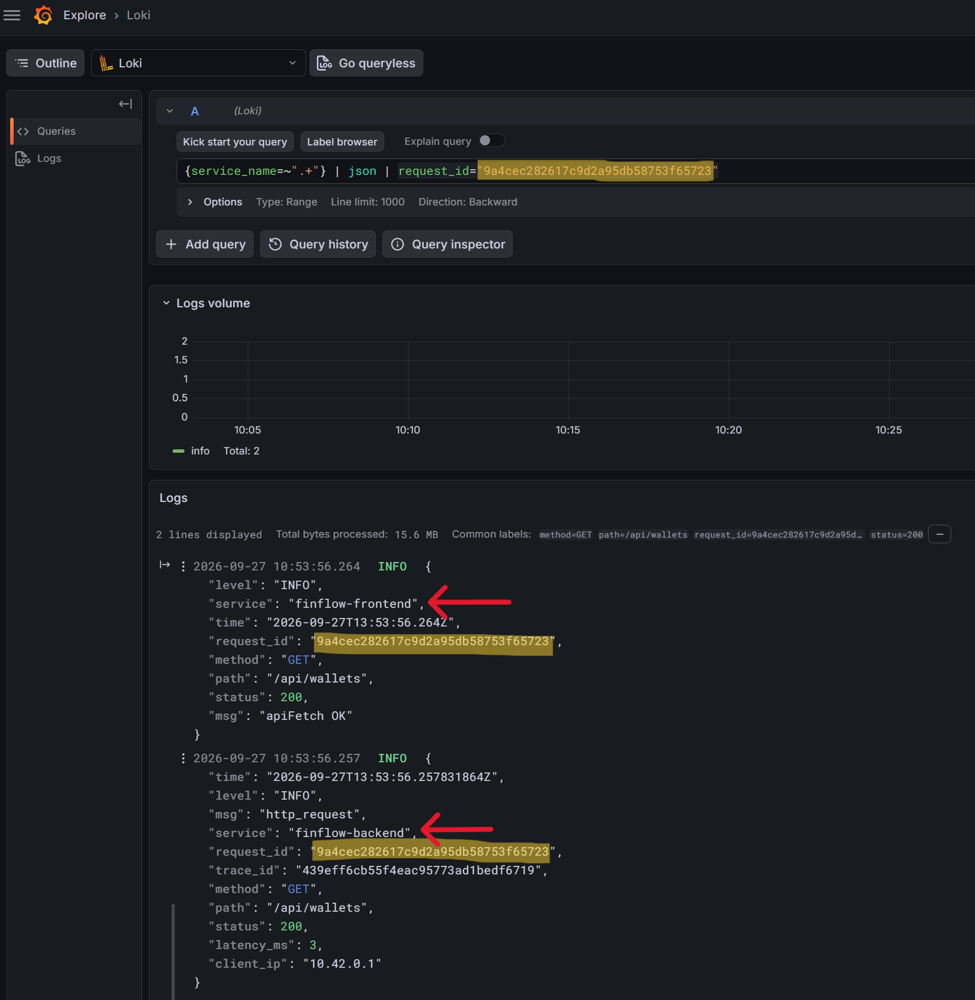
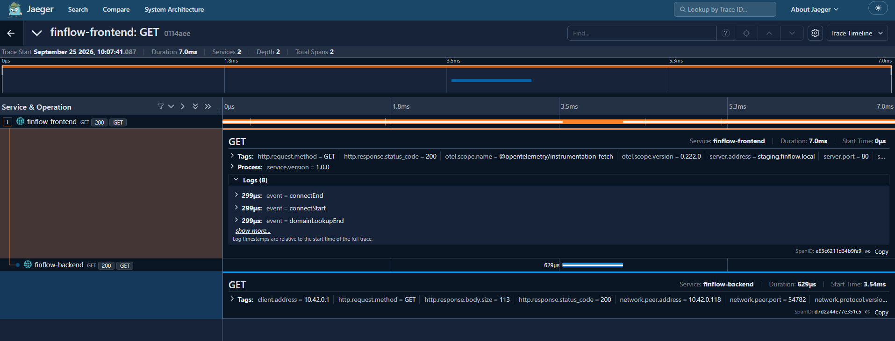
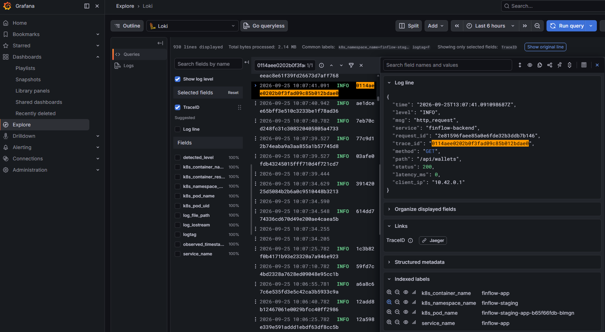
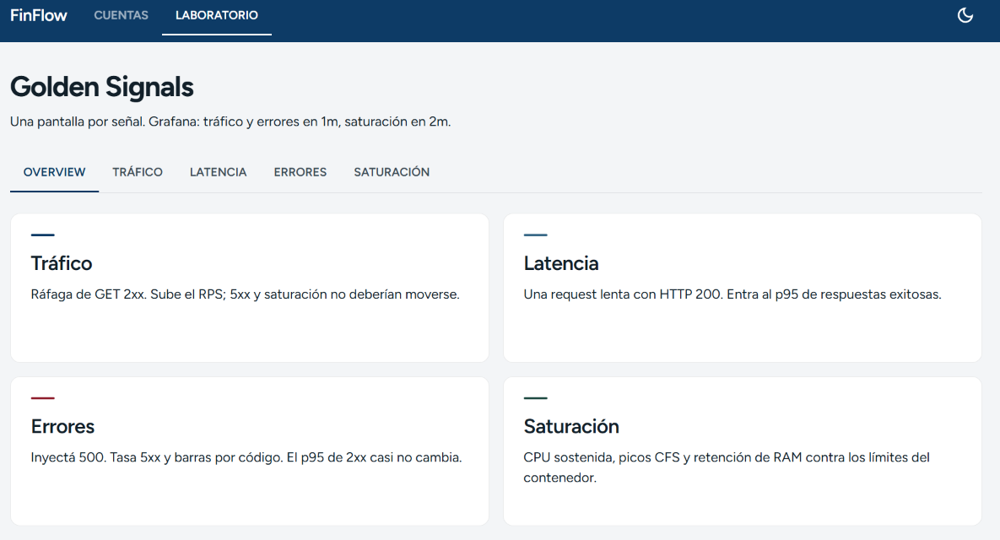

# Informe Técnico — TP Observabilidad y Confiabilidad

### Integrantes

* **Josias Ñañez**
* **Lautaro Castro**
* **Jeronimo Massaro**
* **Maximiliano Cravero**
* **Gabriel Oliva**

---


## 0. Resumen Ejecutivo

FinFlow es una fintech de billeteras y pagos desplegada en un clúster local Kubernetes (K3D) gestionado por GitOps (ArgoCD). Sobre ese sistema implementamos los tres pilares de la observabilidad, **métricas, logs y trazas** con Prometheus/Grafana, Loki y Jaeger, más un dashboard con las 4 Golden Signals. Los logs y las trazas están correlacionados: cada petición puede seguirse entre frontend y backend mediante un `request_id` en los logs, y desde un log en Loki se salta a su traza en Jaeger, y viceversa, mediante el `trace_id`. Como ejercicio adicional, construimos un **laboratorio de simulación de fallos** (`/lab`) para generar carga y errores controlados y ver en vivo cómo reaccionan esas 4 señales.

---

## 1. El Sistema: FinFlow

- **Qué es:** fintech con billeteras (`/api/wallets`) y transferencias (`/api/payments`).
- **Servicios:** frontend (React) + backend (Go/Gin) + PostgreSQL + Redis.
- **Comunicación entre servicios:** el frontend consume la API REST del backend; el backend persiste en Postgres y cachea en Redis.


*Figura 1: Diagrama de arquitectura de la aplicación FinFlow y sus vínculos con los servicios de observabilidad y monitoreo*

---

## 2. Despliegue del stack de observabilidad

FinFlow corre sobre un clúster local K3D gestionado por GitOps con ArgoCD, y el stack de observabilidad se despliega de la misma forma que la aplicación. Los puntos principales son:

- **GitOps con ArgoCD:** el stack completo (Prometheus, Grafana, Loki, Jaeger y el Collector de OpenTelemetry) se despliega como una Application de ArgoCD (`finflow-infra`), con sincronización automática. Cualquier cambio se aplica desde el repositorio y cualquier modificación manual en el clúster se revierte sola.
- **Grafana como código:** los DataSources y dashboards se provisionan mediante ConfigMaps versionados en Git, sin configuración manual.
- **Collector *gateway* de OpenTelemetry (`deployment`):** recibe por OTLP/HTTP (puerto `:4318`) las trazas y logs que envían el frontend y el backend. Tiene CORS habilitado para los orígenes de prod y staging, lo que permite que el navegador exporte directamente al Collector. Tiene dos pipelines: el de trazas (`otlp` → `batch` → Jaeger por gRPC y `debug` para inspección local) y el de logs (`otlp` → `batch` → `otlphttp/loki`), por el que llegan los logs del frontend a Loki.
- **Ingress del Collector:** los endpoints `/v1/traces` y `/v1/logs` se exponen fuera del clúster, lo que permite que el navegador envíe telemetría al gateway.
- **Collector *agent* de OpenTelemetry (`daemonset`):** recolecta los logs de los contenedores y los envía a Loki. No participa del pipeline de trazas, que corre íntegramente por el gateway.
- **Jaeger:** se instala con el Helm chart oficial en el namespace `finflow-infra`, y es quien persiste las trazas y sirve la UI (`:16686`).
- **Instrumentación de la app:** el backend recibe el endpoint del Collector mediante la variable `OTEL_EXPORTER_OTLP_ENDPOINT`, por lo que cada versión nueva sale instrumentada sin configuración adicional.
- **Despliegue canary con Argo Rollouts:** el backend se despliega con un `Rollout` que envía primero el 33% del tráfico a la versión nueva y queda en pausa. En ese momento se verifican en el dashboard de Golden Signals los errores y la latencia antes de promoverla al 100% o hacer rollback.

---

## 3. Métricas y las 4 Golden Signals

Para monitorear FinFlow aplicamos las 4 Golden Signals sobre el backend Go/Gin, usando las métricas que Prometheus recolecta de Gin (tráfico, latencia y errores) y de cAdvisor (saturación de CPU y memoria del contenedor de la aplicación). Todas se visualizan en un único dashboard de Grafana, provisionado como código.

### 3.1. Recolección de métricas

- **Prometheus** scrapea el backend Go (métricas de Gin: `gin_requests_total`, `gin_request_duration_seconds_bucket`).
- **cAdvisor** (kubelet) expone métricas reales de contenedor: `container_cpu_usage_seconds_total`, `container_memory_working_set_bytes`, `container_spec_cpu_quota`, etc.

### 3.2. Las 4 Golden Signals

| Señal | Métrica | Query PromQL |
|---|---|---|
| **Tráfico** | `gin_requests_total` | `sum(rate(gin_requests_total{namespace=~"$namespace"}[1m])) by (code)` |
| **Latencia** | `gin_request_duration_seconds_bucket` | `histogram_quantile(0.95, sum(rate(gin_request_duration_seconds_bucket{namespace=~"$namespace",code=~"[23].."}[5m])) by (le))` |
| **Errores** | `gin_requests_total` | `sum(rate(gin_requests_total{namespace=~"$namespace",code=~"[45].."}[1m])) by (code, url)` |
| **Saturación (CPU)** | cAdvisor | `sum by (pod) (rate(container_cpu_usage_seconds_total{namespace=~"$namespace",container="finflow-app"}[2m])) / sum by (pod) (container_spec_cpu_quota{namespace=~"$namespace",container="finflow-app"} / container_spec_cpu_period{namespace=~"$namespace",container="finflow-app"})` |
| **Saturación (memoria)** | cAdvisor | `sum by (pod) (container_memory_working_set_bytes{namespace=~"$namespace",container="finflow-app"}) / sum by (pod) (container_spec_memory_limit_bytes{namespace=~"$namespace",container="finflow-app"})` |


**Algunas aclaraciones:**

- La señal de Errores cuenta las respuestas 4xx y 5xx, separadas por código y por ruta (`url`), lo que permite ver qué endpoint está fallando y distinguir errores del cliente (4xx) de fallos del servidor (5xx).
- La saturación se mide sobre dos recursos, CPU y memoria, expresados como proporción del límite asignado a cada pod de la aplicación (`finflow-app`). Un valor cercano a 1 indica que el servicio está por quedarse sin ese recurso.
- La latencia se calcula solo sobre las respuestas exitosas (`code=~"[23].."`), porque un error puede responder mucho más rápido o mucho más lento que una petición normal y distorsionaría el p95. Los fallos se miden aparte con la señal de Errores. Esta separación se comprueba en el laboratorio de la sección 6: una respuesta lenta sube el p95, mientras que un error 5xx sube la tasa de errores sin mover casi el p95.


*Figura 2: Dashboard de Grafana mostrando las 4 Golden Signals*

---

## 4. Logs estructurados y correlación

Los logs complementan a las métricas: mientras estas indican que algo anda mal, los logs muestran qué pasó en cada petición. En FinFlow, el frontend y el backend emiten logs en formato JSON que se centralizan en Loki y se consultan desde Grafana. Cada log incluye un `request_id` que permite seguir una misma petición a través de ambos servicios. En esta sección se describe el formato de dichos logs, cómo se genera y propaga el `request_id`, y la evidencia de la correlación entre los logs de ambos servicios.

### 4.1. Formato de los logs estructurados (JSON) en Frontend

Todo el logging del frontend pasa por una única función centralizada, `logEvent`, definida en `Logger.js`. Cada log se arma como un objeto JSON estructurado con los siguientes campos:

- **`level`**: severidad del log (`INFO`, `ERROR`).
- **`service`**: nombre del servicio emisor (`finflow-frontend`), fijo para todos los logs del frontend.
- **`time`**: timestamp en formato ISO 8601.
- **`request_id`, `method`, `path`, `status` y `msg`**: Atributos propio del evento.

Un log real emitido por el frontend tiene esta forma:

```json
{
  "level": "INFO",
  "service": "finflow-frontend",
  "time": "2026-09-28T21:45:34.372Z",
  "request_id": "1d33e43aa648063a7a68a9fd12136fa7",
  "method": "GET",
  "path": "/api/wallets",
  "status": 200,
  "msg": "apiFetch OK"
}
```

Este JSON se envía al **Collector de OpenTelemetry**, mediante un POST HTTP al endpoint estándar de logs (`/v1/logs`), siguiendo el formato de exportación OTLP (`resourceLogs` → `scopeLogs` → `logRecords`):

```javascript
const body = {
    resourceLogs: [{
        resource: { attributes: [{ key: 'service.name', value: { stringValue: service } }] },
        scopeLogs: [{
            logRecords: [{
                timeUnixNano: String(Date.now() * 1e6),
                severityText: severity,
                body: { stringValue: JSON.stringify(jsonLogBody) }, <-- Log a enviar
                attributes: []
            }],
        }],
    }],
};
```

El Collector gateway reenvía estos logs a Loki, donde se consultan junto con los del backend desde Grafana.

### 4.1.1. Generación y propagación del `request_id` a nivel de aplicación

Independientemente del `trace_id` de OpenTelemetry, en el frontend se genera un identificador propio en cada request usando la API de Web Crypto:

```javascript
function generateRequestId() {
  const bytes = new Uint8Array(16);
  window.crypto.getRandomValues(bytes);
  return Array.from(bytes, (byte) => byte.toString(16).padStart(2, '0')).join('');
}
```

Este `request_id` se envía en un header custom hacia el backend:

```javascript
headers: {
  ...(options.headers ?? {}),
  'X-Request-ID': requestId,
}
```

Como se vio en el punto anterior, se incluye además como atributo en cada log emitido (`request_id`). A diferencia del `trace_id` (que depende del SDK de OTel y de la propagación W3C), el `request_id` es una correlación de aplicación simple: alcanza con que el backend loguee el valor recibido en `X-Request-ID` para poder cruzar logs de frontend y backend de un mismo request, incluso en escenarios donde la traza de OTel no esté disponible.

En la siguiente captura se observan los headers que envía el frontend en una petición al backend:


*Figura 3: Consola del Browser mostrando los headers `X-Request-ID` y `traceparent` generados desde el frontend. El `traceparent` se explica en la sección 5*

De esta manera, cada log estructurado del frontend queda correlacionado con su request de aplicación (`request_id`).

### 4.2. Formato de los logs estructurados (JSON) en Backend

El backend (Go) emite sus logs con `log/slog` en formato JSON a stdout. Todos los loggers derivan del logger base, que fija el campo `service` en `finflow-backend`, y el middleware de request agrega el `request_id` (y, si hay un span activo, el `trace_id`). El resultado es una línea JSON por evento:

- **`time`**: timestamp en formato ISO 8601.
- **`level`**: severidad del log (`INFO` como nivel mínimo).
- **`msg`**: nombre del evento; el access log de cada request usa siempre `http_request`.
- **`service`**: nombre del servicio emisor (`finflow-backend`), fijo para todos los logs del backend.
- **`request_id`**: identificador de correlación de la petición.
- **`trace_id`**: identificador de la traza de OpenTelemetry, presente cuando la petición corre dentro de un span activo.
- **`method`, `path`, `status`, `latency_ms` y `client_ip`**: datos de la petición HTTP.

Un log real emitido por el backend tiene esta forma:

```json
{
  "time": "2026-09-28T21:45:34.367998428Z",
  "level": "INFO",
  "msg": "http_request",
  "service": "finflow-backend",
  "request_id": "1d33e43aa648063a7a68a9fd12136fa7",
  "trace_id": "bd46dc848efc2e469c6b4ee269d11b14",
  "method": "GET",
  "path": "/api/wallets",
  "status": 200,
  "latency_ms": 0,
  "client_ip": "10.42.0.1"
}
```

#### 4.2.1. Propagación del `request_id`

El router de Gin se crea con `gin.New()` en lugar de `gin.Default()`, para reemplazar el logger de texto plano de Gin por un middleware propio (`RequestIDMiddleware`) que emite los logs en JSON. Para cada petición, este middleware:

1. **Obtiene el `request_id`:** reutiliza el que llega desde el frontend en el header `X-Request-ID` y, si no vino ninguno, genera uno nuevo. Así una misma petición se puede seguir a través de varios servicios.
2. **Lo guarda en el contexto:** crea un logger que ya lleva ese identificador y lo almacena en el `context.Context` de Go. De esta forma, cualquier log emitido durante la petición (handler, servicio o capa de datos) lo incluye automáticamente, sin pasarlo manualmente.
3. **Lo devuelve en la respuesta:** lo agrega al header de la respuesta HTTP, para que el frontend pueda loguear el mismo identificador.
4. **Registra un único log por petición:** al terminar de procesarla, emite el log `http_request` con el método, la ruta, el estado y la latencia.

El campo `trace_id` corresponde a la traza distribuida de OpenTelemetry y es el que vincula estos logs del backend con las trazas que se originan en el frontend. Su funcionamiento se explica en la sección 5.4.

### 4.3. Evidencia de logs y correlación mediante `request_id`

Para verificar el funcionamiento de los logs estructurados, se generó una petición desde `finflow-frontend` hacia `finflow-backend` (`GET /api/wallets`) y se buscaron los logs resultantes en Grafana Loki.

En primer lugar, se observa el log emitido por el frontend, con su formato JSON estructurado y el `request_id` generado para esa petición:


*Figura 4: Log generado a partir de la petición originada en `finflow-frontend` a `GET /api/wallets`. El `request_id` se encuentra resaltado en amarillo.*

Luego, al buscar ese mismo `request_id` en Loki, aparecen tanto el log del frontend como el del backend. Esto confirma que el header `X-Request-ID` se propaga correctamente y que ambos registros pertenecen a la misma petición:


*Figura 5: Correlación entre los logs de frontend y backend (apuntados por flecha en rojo) mediante `request_id` (resaltado en amarillo)*

De esta forma, ante un error o una respuesta lenta, se puede seguir una misma petición a través de ambos servicios con una sola búsqueda, sin depender de la traza de OpenTelemetry.

---

## 5. Trazas distribuidas con OpenTelemetry

Las trazas muestran el recorrido de una petición a través de los servicios y cuánto tiempo pasa en cada uno. En FinFlow, el frontend y el backend se instrumentan con OpenTelemetry y envían sus spans al Collector, que los reenvía a Jaeger. El despliegue del Collector y de Jaeger se describe en la sección 2.

### 5.1. SDK OpenTelemetry en el backend (Go)
 
`internal/telemetry/tracer.go` expone `InitTracer(ctx, serviceName)`, que se invoca una única vez al arrancar el proceso (`cmd/finflow/main.go`) con `serviceName = "finflow-backend"`:
 
- Exportador **OTLP/HTTP** (`otlptracehttp`) hacia el endpoint definido por la variable de entorno `OTEL_EXPORTER_OTLP_ENDPOINT` (en el clúster apunta al Collector gateway, `otelcol-gateway:4318`; en local cae por defecto a `localhost:4318`), publicando en `/v1/traces` sin TLS (`WithInsecure`, válido dentro del clúster).
- Propagador compuesto **W3C TraceContext + Baggage**, registrado como propagador global (`otel.SetTextMapPropagator`) para que cualquier request entrante/saliente respete el header `traceparent`.
- Si `InitTracer` falla, la app no aborta: loguea un warning y sigue sin tracing, y en éxito se registra el `Shutdown` del `TracerProvider` con `defer` (timeout de 5s) para flushear los spans pendientes al cerrar el proceso.

La instrumentación del servidor HTTP es automática y no invasiva: en `internal/api/server.go`, el router de Gin se envuelve con `otelhttp.NewHandler(router, "finflow-backend")`, por lo que cada request entrante genera un span de servidor sin tener que instrumentar handler por handler.

### 5.2. Web SDK en el frontend
 
`frontend/src/Telemetry.js` (`initTelemetry()`, invocada al bootstrear la app en `main.jsx`, antes del render) arma el pipeline de tracing en el navegador:
 
- `WebTracerProvider` con `resource` `service.name: "finflow-frontend"`.
- Exportador `OTLPTraceExporter` (HTTP) apuntando a `${VITE_OTEL_COLLECTOR_URL}/v1/traces`, envuelto en un `BatchSpanProcessor` para no disparar un request por cada span.
- `ZoneContextManager` como context manager, necesario para que el contexto de traza sobreviva a callbacks asíncronos (`fetch`, promesas) en el navegador.
- `DocumentLoadInstrumentation`: instrumenta automáticamente la carga de la página (spans de navegación/recursos).
- `FetchInstrumentation`: instrumenta todas las llamadas `fetch()` y es la responsable de la propagación del `traceparent`. La propagación no se hace a cualquier dominio (rompería CORS con terceros): `propagateTraceHeaderCorsUrls` se arma con una regex construida a partir del hostname de `VITE_API_URL`, de forma que el header solo se agrega en los requests hacia el backend de FinFlow.

### 5.3. Formato de las trazas (JSON / OTLP)

Igual que los logs (sección 4.1), las trazas viajan hacia el Collector como JSON, siguiendo el protocolo estándar OTLP/HTTP: cada request al endpoint `/v1/traces` lleva un body con la forma `resourceSpans` → `scopeSpans` → `spans`, análoga a la de los logs (`resourceLogs` → `scopeLogs` → `logRecords`). Tanto `otlptracehttp` en el backend (Go) como `OTLPTraceExporter` en el frontend (Web SDK) generan este mismo formato, lo que permite que ambos terminen en el mismo trace dentro de Jaeger.

Un span exportado (por ejemplo, el span de servidor que `otelhttp.NewHandler` genera en el backend para un `GET /api/wallets`) tiene esta forma:

```json
{
  "resourceSpans": [{
    "resource": {
      "attributes": [
        { "key": "service.name", "value": { "stringValue": "finflow-backend" } }
      ]
    },
    "scopeSpans": [{
      "spans": [{
        "traceId": "0114aee0202b0f3fad09c85b012bdae0",
        "spanId": "b74a5e0f3c9d21aa",
        "parentSpanId": "4f21ac9b7e3d10cc",
        "name": "GET /api/wallets",
        "kind": "SPAN_KIND_SERVER",
        "startTimeUnixNano": "1757900103000000000",
        "endTimeUnixNano": "1757900103004000000",
        "attributes": [
          { "key": "http.method", "value": { "stringValue": "GET" } },
          { "key": "http.route", "value": { "stringValue": "/api/wallets" } },
          { "key": "http.status_code", "value": { "intValue": "200" } }
        ],
        "status": { "code": "STATUS_CODE_OK" }
      }]
    }]
  }]
}
```

Puntos clave de este formato:
- El `traceId` es el campo que conecta ambos mundos.
- `parentSpanId` arma la jerarquía: el span de servidor del backend tiene como padre al span de cliente que generó `FetchInstrumentation` en el navegador, formando la cascada que se ve en Jaeger.
- A diferencia de los logs (donde el contenido va como texto embebido en un único campo `body.stringValue`), en las trazas cada dato relevante viaja como atributo estructurado (`attributes[]`), siguiendo las Semantic Conventions de OpenTelemetry (`http.method`, `http.route`, `http.status_code`). Eso es lo que le permite a Jaeger mostrar columnas y facetas de búsqueda sin tener que parsear texto libre.

### 5.4. Traza distribuida de punta a punta y correlación mediante `trace_id`
 
El flujo de una traza completa (ej. el usuario crea una transferencia desde la app) es:
 
1. El frontend dispara un `fetch()` hacia `/api/payments`. `FetchInstrumentation` crea un span cliente y, como el dominio matchea la regex de `VITE_API_URL`, inyecta el header `traceparent` con el `trace_id`/`span_id` generados en el navegador.
2. Ese `fetch` viaja en paralelo por dos canales: los spans del navegador van directo al Collector gateway (`/v1/traces`), y el request HTTP en sí llega al backend.
3. En el backend, `otelhttp.NewHandler` lee el `traceparent` entrante, continúa la misma traza (no crea una traza nueva) y abre un span de servidor para el request.
4. El backend exporta ese span vía OTLP/HTTP al mismo Collector gateway, que lo reenvía a Jaeger junto con los spans del frontend.
5. En Jaeger, al buscar por ese `trace_id`, el trace queda compuesto por el span del cliente (`finflow-frontend`) y el span del servidor (`finflow-backend`) como hijo, mostrando el salto completo navegador → backend.

Como el `trace_id` acompaña a la petición en todo su recorrido, también permite vincular las trazas con los logs. Mientras el `request_id` (sección 4) es un identificador propio de la aplicación, el `trace_id` lo genera OpenTelemetry: los spans del frontend y del backend lo comparten, y el backend lo incluye además en cada log (sección 4.2). Grafana aprovecha ese campo común: el datasource de Loki extrae el `trace_id` de cada línea de log y arma un enlace hacia Jaeger (`Loki → Jaeger`), y el datasource de Jaeger hace lo inverso, con una consulta a Loki filtrada por ese mismo `trace_id` (`Jaeger → Loki`). Así, desde un log se salta con un clic a su traza completa, y desde una traza se ven los logs asociados.
 

*Figura 6: Cascada distribuida completa generada a partir de la petición originada en `finflow-frontend` hacia `finflow-backend` (`GET /api/wallets`, HTTP 200), correlacionada con el mismo `trace_id`.*


*Figura 7: Registro estructurado en Grafana Loki para el servicio `finflow-backend` con el atributo `trace_id` (`0114aee0202b0f3fad09c85b012bdae0`) y el campo derivado configurado (`TraceID -> Jaeger`) para navegación contextual directa hacia la traza.*

---

## 6. Simulación de fallos (`/lab`)

Para comprobar que la observabilidad detecta problemas reales, construimos un laboratorio que genera carga y fallos controlados y permite ver en vivo cómo reacciona cada una de las 4 Golden Signals.

### 6.1. Qué es y para qué sirve

`/lab` es una sección separada de la app (fuera de `/`, el flujo real de billeteras/pagos) pensada para generar carga y fallos controlados y ver en vivo cómo reaccionan las 4 Golden Signals del dashboard. Es una herramienta de demostración donde cada botón dispara una acción puntual y el efecto se observa directamente en Grafana.

La razón de existir por separado: los flujos reales de FinFlow (`/api/wallets`, `/api/payments`) dependen de Postgres/Redis y no permiten forzar a demanda un pico de CPU, memoria o un 5xx sin tocar la lógica de negocio. `/lab` expone ese control de forma explícita y acotada (con topes de seguridad server-side) sin ensuciar el código de producción.

### 6.2. Qué botón dispara qué

| Señal | UI | Endpoint | Efecto medible |
|---|---|---|---|
| Tráfico | `/lab/traffic` | `GET /api/lab/ok` (N en paralelo) | Sube `gin_requests_total` / RPS |
| Latencia | `/lab/latency` | `POST /api/lab/slow {delay_ms}` → siempre 200 | Entra al p95 de `code=~"[23].."` |
| Errores | `/lab/errors` | `POST /api/lab/error {code}` → siempre 5xx (`AllowedErrorStatus` fuerza 500/502/503) | Sube la tasa de 5xx; el p95 de exitosas casi no se mueve |
| CPU | `/lab/saturation` | `POST /api/lab/cpu {duration_ms}` (`lab.Spin`, loop real) | `container_cpu_usage_seconds_total` / quota, ventana `[2m]` |
| Throttle CFS | `/lab/saturation` | N × `POST /api/lab/burst {spin_ms}` en paralelo | Picos de throttle CFS |
| Memoria | `/lab/saturation` | `POST /api/lab/memory {megabytes}` / `POST /api/lab/memory/release` | `container_memory_working_set_bytes`, se mantiene hasta liberar |

Topes de seguridad, todos definidos en `internal/lab/limits.go` y aplicados server-side (no dependen de lo que mande el cliente): delay máx. 5 s, CPU máx. 10 s, burst máx. 200 ms, memoria máx. 128 MiB, códigos de error limitados a 500/502/503.

La siguiente captura muestra la interfaz del laboratorio, desde donde se dispara cada acción:


*Figura 8: Interfaz del laboratorio del frontend*

---

## 7. Conclusiones

Implementamos los tres pilares de la observabilidad sobre FinFlow y los desplegamos con GitOps, por lo que todo el stack queda versionado y se recupera solo ante cambios manuales. Las métricas se organizan en las 4 Golden Signals, los logs estructurados se siguen entre frontend y backend con el `request_id`, y las trazas distribuidas se vinculan con los logs mediante el `trace_id`, lo que permite saltar de un log a su traza y viceversa. El laboratorio de simulación de fallos permitió comprobar en vivo que cada señal reacciona como se espera, y el despliegue canary aprovecha ese dashboard para validar una versión antes de promoverla.

Como limitaciones, el entorno es un clúster local y no un entorno productivo. La saturación se mide solo sobre el contenedor de la aplicación, PostgreSQL y Redis no tienen monitoreo propio, y el sistema no cuenta con alertas automáticas: hoy los problemas se detectan mirando el dashboard. Incorporar alertas y monitorear la base de datos y el caché serían los siguientes pasos naturales.

